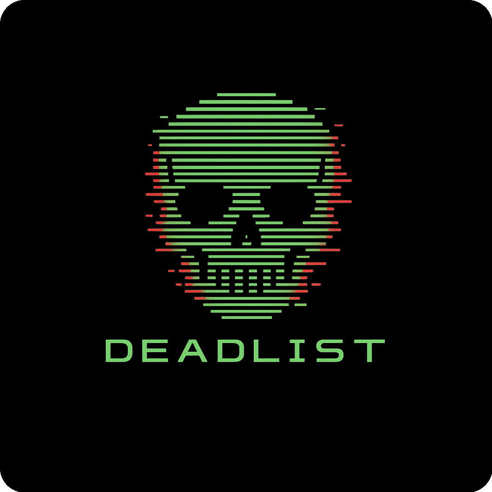
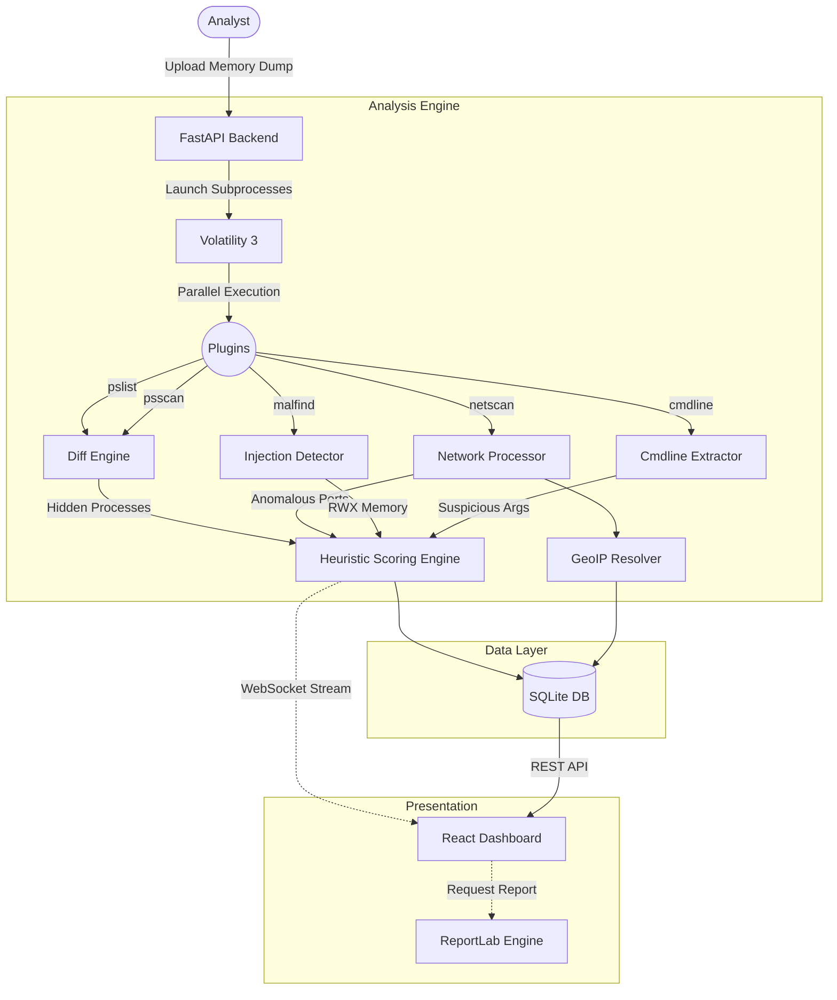

<div align="center">



**The process that's dead to the system. Found alive by DeadList.**

A modern, web-based memory forensics platform powered by Volatility 3. Detects hidden malware, rootkits, injected code, and suspicious network activity that evade standard system monitoring tools.

[](https://opensource.org/licenses/MIT)
[](https://www.python.org/downloads/)
[](https://react.dev/)
[](https://github.com/volatilityfoundation/volatility3)

[Features](#-key-features) • [Architecture](#-architecture--pipeline) • [Tech Stack](#-tech-stack) • [Setup](#-installation--setup) • [Usage](#-usage) • [Scoring](#-scoring-system)

</div>

---

## ✨ Key Features

- **DKOM Detection**: Uncovers processes hidden via Direct Kernel Object Manipulation by cross-referencing `pslist` and `psscan` outputs.
- **Parallel Forensic Analysis**: Concurrently executes 5 crucial Volatility 3 plugins (`pslist`, `psscan`, `netscan`, `malfind`, `cmdline`) for rapid triage.
- **Heuristic Threat Scoring**: Evaluates processes across 7 distinct criteria (hiding, injection, mimicry, networking anomalies, parentage, ports, and command line arguments).
- **Real-Time Interactive Dashboard**: Live WebSocket streaming populates process tables, network graphs, and interactive process trees dynamically as analysis progresses.
- **Geospatial Intelligence**: Automatically resolves and plots suspicious network connections on an interactive global map.
- **Automated Reporting**: One-click generation of professional, structured PDF forensic reports for incident response documentation.
- **Persistent Evidence History**: Browse, filter, and review past analyses with embedded SQLite storage.

---

## 🏗 Architecture & Pipeline

DeadList bridges the gap between complex CLI forensic tools and modern UI/UX, orchestrated through an asynchronous FastAPI backend and a reactive React frontend.



---

## 💻 Tech Stack

### Frontend
- **React 19**: Modern component-based UI.
- **Vite**: Ultra-fast frontend build tooling.
- **Zustand**: Lightweight global state management.
- **Tailwind CSS v4**: Utility-first styling for a sleek, dark-mode-first aesthetic.
- **Recharts & React Simple Maps**: Data visualization and geospatial plotting.
- **Framer Motion**: Smooth micro-animations and transitions.

### Backend
- **FastAPI**: High-performance asynchronous Python web framework.
- **SQLAlchemy (Asyncio)**: ORM for database interactions.
- **SQLite (aiosqlite)**: Persistent, zero-config relational database.
- **WebSockets**: Real-time bidirectional event streaming.
- **ReportLab**: Programmatic PDF report generation.

### Engine
- **Volatility 3**: The world's most advanced memory forensics framework.

---

## 🚀 Installation & Setup

We highly recommend running DeadList via Docker. It bundles the Volatility 3 framework, required Python dependencies, and Windows symbol tables out-of-the-box, ensuring zero friction.

### Prerequisites
- [Docker Engine](https://docs.docker.com/engine/install/) & [Docker Compose](https://docs.docker.com/compose/install/)

### Docker Deployment (Recommended)

1. **Clone the repository:**
   ```bash
   git clone https://github.com/YOUR_USERNAME/DeadList.git
   cd DeadList
   ```

2. **Start the environment:**
   ```bash
   docker compose up -d --build
   ```
   > **Note:** The first startup will automatically download ~800MB of Windows Symbol Tables (ISF files) required by Volatility 3. Subsequent starts are instantaneous.

3. **Access the platform:**
   - UI Dashboard: [http://localhost:3000](http://localhost:3000)
   - API Documentation (Swagger): [http://localhost:8000/docs](http://localhost:8000/docs)

### Local Development Setup

If you wish to run the components independently or contribute to the codebase:

**Backend:**
```bash
cd backend
python -m venv venv
source venv/bin/activate  # On Windows: .\venv\Scripts\activate
pip install -r requirements.txt
# Requires manual installation of Volatility 3 and Symbol tables for real analysis
uvicorn main:app --host 127.0.0.1 --port 8000 --reload
```

**Frontend:**
```bash
cd frontend
npm install
npm run dev
```

---

## ⚙️ Configuration

DeadList is configured via environment variables. Copy `.env.example` to `.env` to customize behavior.

| Variable | Default | Description |
|---|---|---|
| `MOCK_MODE` | `False` | `True` simulates analysis without Volatility (for UI testing). `False` requires real memory dumps. |
| `MAX_UPLOAD_SIZE_GB` | `32` | Maximum allowed memory dump upload size. |
| `PLUGIN_TIMEOUT_SECONDS` | `600` | Maximum execution time per Volatility plugin (10 minutes). |
| `LOG_LEVEL` | `INFO` | Application logging verbosity (`DEBUG`, `INFO`, `WARNING`, `ERROR`). |
| `CORS_ORIGINS` | `http://localhost:5173,http://localhost:3000` | Allowed origins for API requests. |

---

## 📖 Usage

### 1. Acquiring a Memory Dump
If you don't have a RAM dump, you can test DeadList using publicly available forensic challenges:
- **MemLabs CTF (Recommended):** [GitHub - stuxnet999/MemLabs](https://github.com/stuxnet999/MemLabs) (Download Lab 1 `.raw` file).
- **Volatility Foundation:** [Memory Samples Wiki](https://github.com/volatilityfoundation/volatility/wiki/Memory-Samples) (e.g., Cridex, ZeuS).

### 2. Running an Analysis
1. Navigate to the **Upload** page.
2. Drag and drop your `.raw`, `.mem`, `.dmp`, or `.vmem` file.
3. The dashboard will automatically transition to the **Live Analysis** view.
4. Watch as Volatility plugins execute concurrently and stream results to the UI.
5. Once complete, explore the Process Table, Network Connections, and Suspicious memory regions.
6. Click **Export Report** to generate a comprehensive PDF summary.

---

## 📊 Scoring System

DeadList utilizes a proprietary heuristic scoring engine to evaluate process suspicion. Scores range from 0 to 100+.

| Trigger | Points | Description |
|---|---|---|
| **DKOM Hidden** | `+50` | Process detected by `psscan` but absent from `pslist`. Strongly indicates a rootkit. |
| **Injected Code** | `+30` | `malfind` detected RWX (Read/Write/Execute) memory regions or hidden VAD tags. |
| **Name Mimicry** | `+10` | Typosquatting of critical system processes (e.g., `svch0st.exe` instead of `svchost.exe`). |
| **Suspicious Network** | `+10` | Active connection on commonly abused ports (e.g., 4444, 1337). |
| **Orphaned Process** | `+5` | Parent Process ID (PPID) does not exist in the active process tree. |
| **Suspicious Port** | `+5` | Listening on non-standard high ports. |
| **Suspicious Cmdline** | `+5` | Arguments containing encoded payloads (e.g., Base64), execution from temp directories, or living-off-the-land binaries. |

**Risk Assessment:**
- 🟢 **Low** (0-29): Expected system or application behavior.
- 🟡 **Medium** (30-49): Anomalous. Requires analyst review.
- 🟠 **High** (50-69): Highly suspicious. Likely malicious activity.
- 🔴 **Critical** (70+): Severe threat (Rootkit / C2 Injection).

---

## 🤝 Contributing

Contributions to DeadList are welcome! Whether it's reporting bugs, improving documentation, or adding new forensic plugins.

1. Fork the repository.
2. Create a feature branch (`git checkout -b feature/amazing-feature`).
3. Commit your changes (`git commit -m 'Add amazing feature'`).
4. Push to the branch (`git push origin feature/amazing-feature`).
5. Open a Pull Request.

---

## 📄 License

This project is licensed under the MIT License - see the [LICENSE](LICENSE) file for details.

## 🙏 Acknowledgements

- The [Volatility Foundation](https://www.volatilityfoundation.org/) for building and maintaining Volatility 3.
- [ip-api.com](https://ip-api.com/) for providing accessible GeoIP resolution.
- The open-source DFIR community for creating exceptional CTFs and memory samples.
